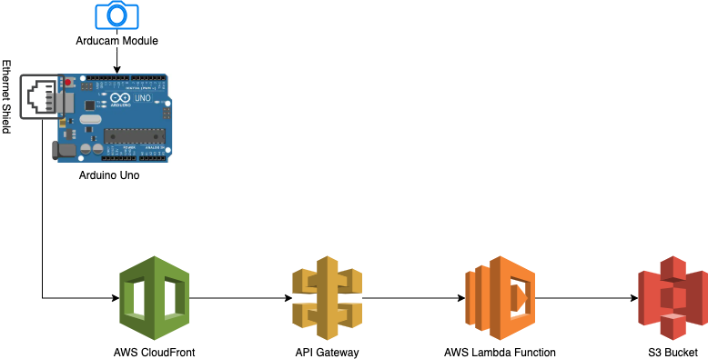

# arduino-stop-motion
Setup an Arduino UNO w/ Ethernet Shield and Arducam module to create a stop-motion camera with AWS integration.  Borrowed heavily from [ikk0/smartcam](https://github.com/ikk0/smartcam)

The basic architecture of this project is utilizing an ethernet connection from the Arduino board to send HTTP requests to a Cloudformation distribution, which forwards the request to an API hosted on AWS API Gateway.  The gateway is configured to trigger a Lambda function, which parses the data and writes it to an S3 bucket.  The Arduino is configured in my code to run the camera capture and HTTP request every 6 hours.

## Requirements
* Arduino UNO
* Arduino Ethernet Shield 2
* Arducam OV2640 MINI 2MP PLUS Module
* Amazon AWS account

## Configuring the AWS Environment
* S3 - S3 buckets are simple file stores.  This is where the stop motion images will end up.  First, navigate to the S3 console (you can use the global search feature to find it).  Click create bucket, give it a name, and ignore the rest and click Create Bucket.
* Lambda - Lambdas are short scripts that AWS will execute, charging you only for the time that they run.  These are perfect for this project, because we don't want to pay for the continuous uptime of an entire EC2 instance when we really only need compute resources for a few seconds every day.  This function will be receiving an HTTP request from the API gateway as an "event," then storing the image data as a JPEG in the S3 bucket we just configured.  Navigate to the Lambda console and click "Create Function."  Use the "Author from scratch" option, give it a name, and in the Runtime dropdown select Python 3.8.  Then click Create function.  In the code editor, copy and paste the code in Lambda/S3StoreImage.py.  This code receives the HTTP request, parses out the JPEG image being sent to it in the event body (in bytes), **appends 0xFF to the start of this data** (JPEG files start with the bytes 0xFF/0xD8.  For some reason, our Arduino script was overwriting the first byte, which causes the files to come through corrupted), gives the file a name based on the current date and hour in UTC, then uploads that file to the S3 bucket.
* IAM Role - Running the lambda above as a test will fail due to insufficient permissions.  To allow these writes, we need to manually give it permission to access the bucket.  Navigate to the IAM console and click "Roles."  Search for the role associated with your Lambda execution (try searching for the name you gave your function).  Click attach policies, then create policy.  Using the visual editor, search for the S3 service, click the checkbox next to write, under Bucket click "Add ARN", enter the name of the bucket you created to house your images, and then click through until the policy is created.  Ensure this policy is attached to the lambda execution role, and you should be good to go.
* API Gateway - API gateway receives HTTP requests and directs them to functions, load balancers, and other resources within the AWS environment.  In this case, the API gateway will direct requests to the lambda function we just configured.  Navigate to the API gateway console, click Create API, use a simple HTTP API, click "Add Integration", select Lambda, and find the lambda function you previously created.  Then click "Add Integration", and ensure that ANY request is being mapped to the Lambda.  Then click through until the gateway is created.
* CloudFront - There's a small snag here.  API Gateway will only receive HTTPS requests, but the Ethernet Shield 2 is only capable of sending unsecure HTTP requests.  Fortunately there's a way around this.  We're going to setup a CloudFront distribution, which is essentially an extra layer between the internet and the API gateway.  First, go to the API Gateway console and click on your API.  Find the default stage, and copy the Invoke URL.  Now in the CloudFront console, click "Create Distribution," and "Get Started."  Paste the invoke URL in the Origin Domain Name field.  For viewer protocol policy, make sure you allow HTTP and HTTPS.  For allowed HTTP methods, make sure to click the third option, allowing GET, HEAD, OPTIONS, PUT, POST, PATCH, and DELETE.  All the other settings should be fine, click create distribution.  Open the details of your new distribution, and grab the domain name.  This will be where you send requests from the Arduino module.

## Configuring the Arduino
[The Arducam docs](https://www.arducam.com/knowledge-base/mini-tutorial/) are a good place to start to get the Arducam module configured.  To use my code, you will need to have the Arducam library installed in the library directory of your Arduino IDE environment.  Make sure to uncomment the `OV2640_MINI_2MP_PLUS` lines in memorysaver.h, as instructed in the documentation.  When I downloaded the library, this happened to be configured for my model by default.

The code found in Arduino/StopMotion.ini configures the Ethernet client to send requests to port 80 of a CloudFront distribution that I set up.  If you've already set up your own AWS environment, take the domain name of the CloudFront distribution you've created and replace the one at the top of my file, the variable `char HOST_NAME[]`.  Once the configuration steps laid out above are followed, running your Arduino script should start sending POST requests to your CloudFront distribution, which will forward to the API Gateway, which will trigger the lambda, which will write the image bytes as a file to the S3 bucket.  Set up your camera somewhere sturdy (I used a breadboard to give it a horizontal base), let it run for a bit, and you'll amass a nice collection of images in the S3 bucket to make a stop motion out of.
 